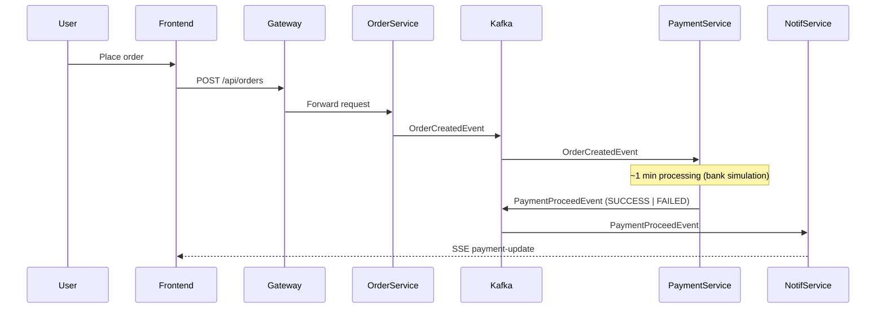

# Event-Driven Microservices Platform

A cloud-native, event-driven microservices platform built with **Spring Boot 3.5** and **Java 21**. Demonstrates real-world architectural patterns: API Gateway routing, database-per-service isolation, reactive I/O, and asynchronous inter-service communication via Apache Kafka.


---

## Event Flow



---

## Modules

| Module | Role | Stack |
|---|---|---|
| `api-gateway` | Entry point, path-based routing | Spring Cloud Gateway |
| `user-service` | User management | Spring Web + MongoDB |
| `product-service` | Product catalog | Spring WebFlux + MongoDB (reactive) |
| `order-service` | Order processing, event producer | Spring Boot + Kafka |
| `payment-service` | Payment handling, event consumer/producer | Spring Boot + Kafka |
| `notif-service` | Notifications, SSE push to frontend | Spring WebFlux + Kafka |
| `common-lib` | Shared DTOs and Kafka event records | Java 21 records |

---

## Running the Project

```bash
docker compose up --build
```

MongoDB auto-initializes on first startup — collections, indexes, and sample data are seeded automatically.

---

## Documentation

- [Architecture & C4 diagrams](docs/archi.md)
- [Design decisions](docs/design-decisions.md)
- [Tech stack](docs/tech-stack.md)
- [Local development](docs/local-dev.md)
- [Kafka operations](docs/kafka-ops.md)
- [Event payload & notification trade-offs](docs/event-payload-tradeoffs.md)
