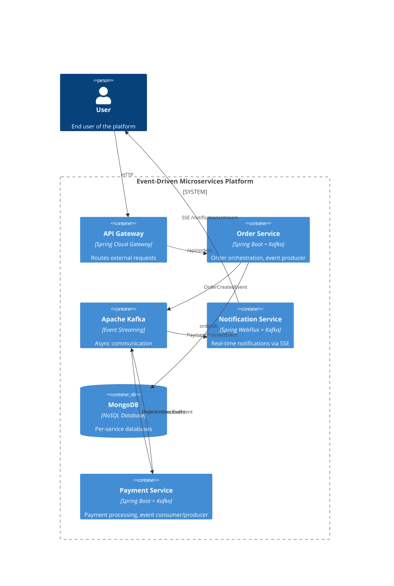
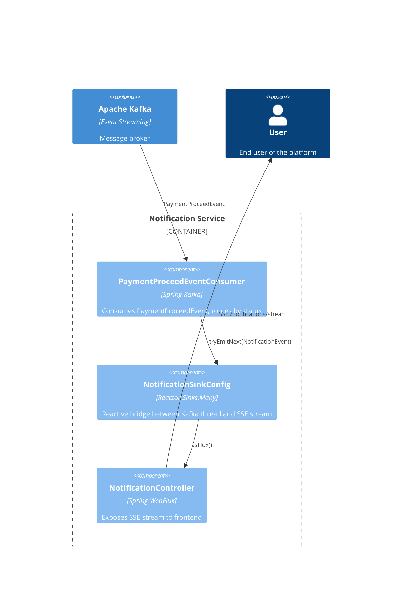

# Architecture Overview

Request flow: **Client → Frontend → API Gateway → Services → MongoDB / Kafka**

```
                      User
                       │
                ┌──────▼────────┐
                │   Frontend    │◄─── SSE ───────────────────┐
                └──────┬────────┘                            │
                ┌──────▼────────┐                     ┌──────┴──────┐
                │  API Gateway  │ :8080               │   Notif MS  │ :8085
                └──────┬────────┘                     └──────▲──────┘
     ┌─────────────────┼──────────────────┐                  │
┌────▼────┐     ┌──────▼─────┐    ┌───────▼────┐      (payment-proceed)
│ User MS │     │  Order MS  │    │ Product MS │             │
│  :8081  │     │   :8083    │    │   :8082    │      ┌──────┴──────┐
└─────────┘     └──────┬─────┘    └────────────┘      │ Payment MS  │
                       │                              │   :8084     │
                  (order-created)                     └─────────────┘
                       │                                     ▲
                       └──────────── Kafka ──────────────────┘
```

For routing and design rationale see [design-decisions.md](design-decisions.md).

---

# Diagrams

## Level 2 — Container Diagram

> User Service and Product Service omitted — standard synchronous REST + MongoDB pattern, not specific to the event-driven architecture.



## Level 3 — Component Diagram (Notification Service)



