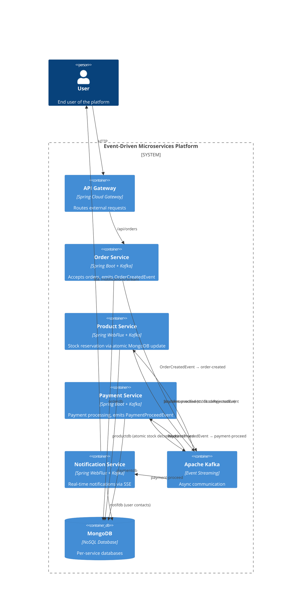
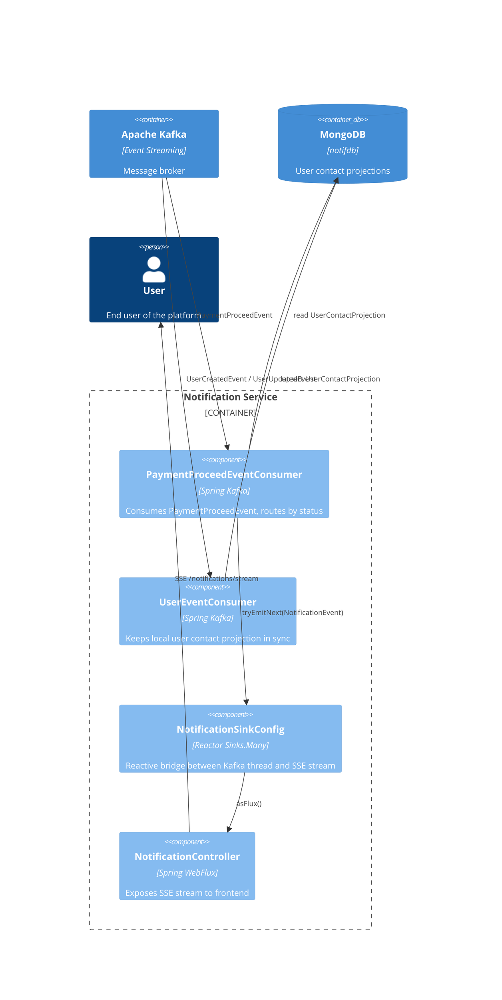

# Architecture Overview

Request flow: **Client → Frontend → API Gateway → Services → MongoDB / Kafka**

```
                      User
                       │
                ┌──────▼────────┐
                │   Frontend    │◄─── SSE ────────────────────────┐
                └──────┬────────┘                                 │
                ┌──────▼────────┐                          ┌──────┴──────┐
                │  API Gateway  │ :8080                    │   Notif MS  │ :8085
                └──────┬────────┘                          └──────▲──────┘
     ┌─────────────────┼──────────────────┐                       │
┌────▼────┐     ┌──────▼─────┐    ┌───────▼────┐           ┌──────┴──────┐
│ User MS │     │  Order MS  │    │ Product MS │           │ Payment MS  │
│  :8081  │     │   :8083    │    │   :8082    │           │   :8084     │
└─────────┘     └──────┬─────┘    └─────┬──▲───┘           └──────▲──────┘
                       │                │  │                      │
                       └────────────────┴──┴──── Kafka ───────────┘
```

## Kafka Event Flow

Order processing follows a **choreography saga**. Stock rejection short-circuits directly to Notif MS — Payment MS is never involved unless stock was successfully reserved.

| Step | Producer | Topic | Consumer(s) |
|---|---|---|---|
| 1 | Order MS | `order-created` | Product MS |
| 2a | Product MS | `stock-reserved` | Payment MS |
| 2b | Product MS | `stock-rejected` | Notif MS ← short-circuit |
| 3 | Payment MS | `payment-proceed` | Notif MS, Product MS |

**Step 2**: Product MS attempts an atomic stock decrement. On success it emits `StockReservedEvent` → Payment MS. On insufficient stock it emits `StockRejectedEvent` → Notif MS directly (no payment was attempted).

**Step 3 (compensation)**: Product MS also subscribes to `payment-proceed`. If the payment failed, it increments the stock back — the compensating transaction. Because `payment-proceed` is only emitted after a successful stock reservation, no flag is needed to distinguish the case.

For routing and design rationale see [design-decisions.md](design-decisions.md).

---

# Diagrams

## Level 2 — Container Diagram



## Level 3 — Component Diagram (Notification Service)


