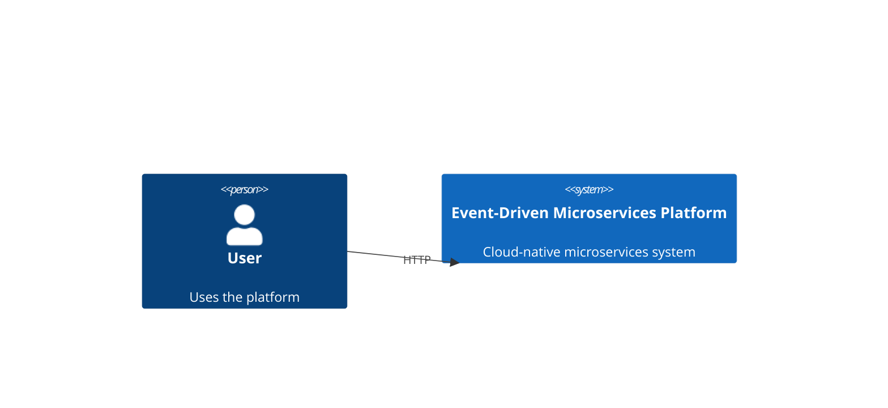
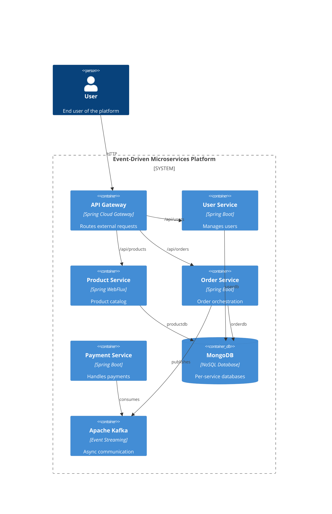
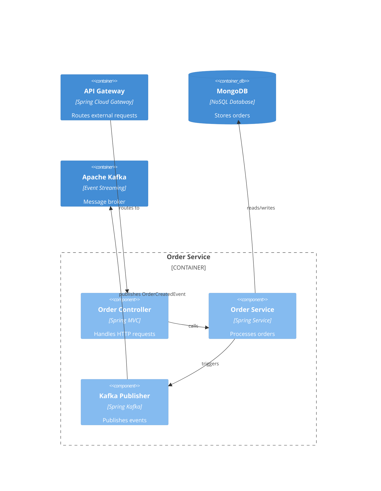
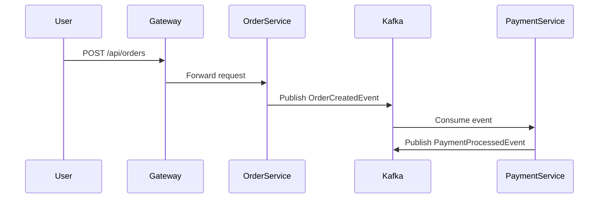

# C4 Architecture Diagrams

## Level 1 — System Context

```mermaid
C4Context
Person(user, "User", "Uses the platform")
System(system, "Event-Driven Microservices Platform", "Cloud-native microservices system")

Rel(user, system, "HTTP")
```

## Level 2 — Container Diagram

```mermaid
C4Container
    Person(user, "User", "End user of the platform")
    System_Boundary(b, "Event-Driven Microservices Platform") {
        Container(apiGateway, "API Gateway", "Spring Cloud Gateway", "Routes external requests")
        Container(userService, "User Service", "Spring Boot", "Manages users")
        Container(productService, "Product Service", "Spring WebFlux", "Product catalog")
        Container(orderService, "Order Service", "Spring Boot", "Order orchestration")
        Container(paymentService, "Payment Service", "Spring Boot", "Handles payments")
        ContainerDb(mongo, "MongoDB", "NoSQL Database", "Per-service databases")
        Container(kafka, "Apache Kafka", "Event Streaming", "Async communication")
    }
    Rel(user, apiGateway, "HTTP")
    Rel(apiGateway, userService, "/api/users")
    Rel(apiGateway, productService, "/api/products")
    Rel(apiGateway, orderService, "/api/orders")
    Rel(userService, mongo, "userdb")
    Rel(productService, mongo, "productdb")
    Rel(orderService, mongo, "orderdb")
    Rel(orderService, kafka, "publishes")
    Rel(paymentService, kafka, "consumes")
```

## Level 3 — Component Diagram (Order Service)

```mermaid
C4Component
    Container(apiGateway, "API Gateway", "Spring Cloud Gateway", "Routes external requests")
    Container_Boundary(b, "Order Service") {
        Component(controller, "Order Controller", "Spring MVC", "Handles HTTP requests")
        Component(service, "Order Service", "Spring Service", "Processes orders")
        Component(publisher, "Kafka Publisher", "Spring Kafka", "Publishes events")
    }
    ContainerDb(mongo, "MongoDB", "NoSQL Database", "Stores orders")
    Container(kafka, "Apache Kafka", "Event Streaming", "Message broker")
    Rel(apiGateway, controller, "routes to")
    Rel(controller, service, "calls")
    Rel(service, publisher, "triggers")
    Rel(service, mongo, "reads/writes")
    Rel(publisher, kafka, "publishes OrderCreatedEvent")
```

## Event Flow

```mermaid
sequenceDiagram
participant User
participant Gateway
participant OrderService
participant Kafka
participant PaymentService

User->>Gateway: POST /api/orders
Gateway->>OrderService: Forward request
OrderService->>Kafka: Publish OrderCreatedEvent
Kafka->>PaymentService: Consume event
PaymentService->>Kafka: Publish PaymentProcessedEvent
```
